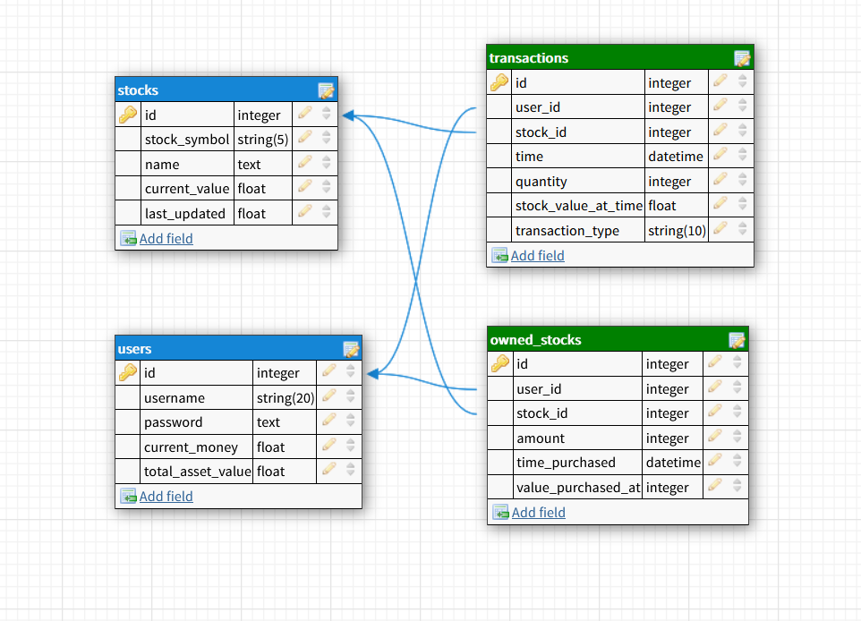

# Springboard-Capstone-Project-1
For my first capstone project I decided to create a stock trading multiplayer game that uses real time stock data,
and provides functionality for users to buy, sell, and see detailed information about stocks, in a competitive environment against other users. Overall, the app follows RESTful routing conventions and maintains secure user authentication and validation.

Core Technologies Used:
* Flask
* SQLAlchemy
* Jinja2
* Postgresql
* WTForms

## Schema
---

<em>Made using dbdesigner.net, a overall summary of the actual schema</em>
* A complete definition of the database is found in [models.py](/models.py) using SQLAlchemy models to represent the tables stored in Postgresql

## External API:
---
Yahoo finance rapid-api: https://rapidapi.com/apidojo/api/yahoo-finance1
* This api is used for getting frequently updated and current data on stocks. Config variables stored in the database in the app_config table toggle when stocks are updated in view functions defined in [app.py](/app.py). I chose this API on the basis that it is very difficult to get current and frequently udpdated stock data for free. In the future, I would hope to make use of the Quandl api's time series data to display graphs and price history of stocks to the user, however this would require paying for the service for current data.

## Important features
* **Gets real and current stock data from external API.**
	* It was important to me to include this due to the multiplayer aspect of the application. If I had used past stock data someone could simply look up the price history of a given stock.
* **Secure user authentication, password encryption, and form validation.**
	* A core part of every web application. Demonstrating my knowledge of these features a project intended to be deployed and functioning with multiple users is must.
* **Parsing large and detailed JSON responses from the external API, and displaying data to the user**
	* The amount of data for a given stock, at a given minute in time, provided by the external API response is very detailed. It was a challenge to extract the data needed, handle mising keys, and then display the information in a coincise format to the user. However, I felt it was important to provide the option for the user to see any data that the API provided.

## User Flow and Routes:
---
###### Login and homepage
* Upon accessesing any valid route on the website, the user is redirected to a login/signup page, given that the user is not already signed in. Newly created users are given $10,000 to begin creating their portfolio
+ After signing in or creating a count, the user is directed to a homepage where they can see a summary of stocks that they currently own, a transaction history, and a ranking of users based on total value of stocks.

	+ Stock data is optionally updated here based on variables stored in the app_config table. Each stock is updated that the user owns, if the config variable is set to true to allow large updates.
* Users can use the navbar to access various links including a search page for stocks, a portfolio management page, and account options.

###### Buying/selling stocks
* Accessing the "/stocks" route provides a search page where a searchbar is provided with autocompletion to search for stocks that are available to buy/sell.
* Submiting the search form redirects to a particular companies' details page ("/stocks/id").

	* here the given stock data is optionally updated as well based on the app_config table.
	* users can buy and sell stock here provided they have the assets available to do so.

* Additionally the user can buy and sell their currently owned stock through the portfolio management page, where infomration about the user's currently owned stocks are displayed.

